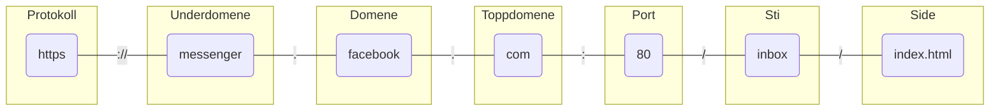

---
{"dg-publish":true,"permalink":"/Kunnskap/URL/","title":"URL","tags":["it1"]}
---

# URL
En <abbr>URL</abbr> (Uniform Resource Locator) er en nettadresse. Eksempler på URLer er <https://nrk.no> og <https://whitehouse.gov>.

En <abbr>URL</abbr> er satt sammen av ulike deler



```
protokoll://underdomene.domene.toppdomene:port/sti/side
```

- Protokoll er ofte `https` som er kryptert form for `http` (HyperText Transfer Protocol). Dette er en protokoll for overføring av HTML. 
	- Nettsider som benytter `http` bør unngås, siden all trafikken vil gå åpent gjennom nettverket. Det gjør at internettleverandør, den som har satt opp WiFI-nettverket og mange flere kan sniffe dataene du utveksler med nettsiden
- Toppdomener er for eksempel `.no`, `.com`, `.co.uk`. Det er et begrenset antall toppdomener man kan velge mellom. For eksempel er `.gov` forbehold amerikanske, statlige institusjoner. 
- Domene er delen av URLen som kommer før toppdomenet. Jeg leier for eksempel domenet `stalegjelsten` på toppdomenet `.no`. Man kjøper/leier domener av en *domeneforhandler*. Det er vanlig at man betaler for et domene.
- Underdomener styres av den som eier domenet. Jeg kan opprette «ubegrenset» mange underdomener til [stalegjelsten.no](https://stalegjelsten.no)
- [[Kunnskap/Server\|Serveren]] kan åpne ulike porter mot internett. For eksempel går internettrafikk på `https`-protokollen på port 80. Hvis du kjører en *Live Preview* i [[Kunnskap/Visual Studio Code\|Visual Studio Code]] så bruker du kanskje port 3000.
- Sti er en referanse til mappen som HTML-dokumentet ligger i. Stien er relativ til [[Kunnskap/Server\|serverens]] rotmappe.
- Side er navnet på filen som inneholder HTML-koden som vises i nettleseren.
